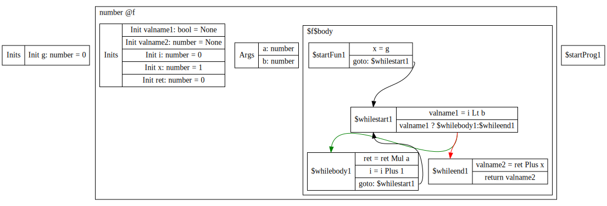

# Design of Optimization on Compiler B Week7 Update

## A. Test cases / Scenarios
> Analyses that extract useful guidance for potential transformations without altering the IR

### 1. Liveness Analysis (Not Implemented)
We are thinking about doing a backward lookup and maintaining a live set for all variables, and potentially count referring instructions for each variable.

**Pseudocode**
```python
1: b: int = 3
2: c: int = 5
3: d: int = 4
4: a: int = 1
5: a = f(b + c)
6: return a
```

**Living Var at each Block**
```python
1: {}
2: b
3: b, c
4: b, c
5: a, b, c
6: a
```

### 2. IR-CFG Visualization
**Real Python**
```python
g: int = 0
def f(a: int, b: int) -> int:
  i: int = 0
  x: int = 1
  ret: int = 0
  x = g
  while i < b:
    ret = ret * a
    i = i + 1
  return ret + x
```
**Dot-plot**



> Modifications on the ast / IR to improve efficiency 
### 3. Eliminate Unreachable Instructions After Return
**Before Optimization**
```python
def f(i:int) -> int:
    return i
    print(i+1)
```
**After Optimization**
```python
def f(i:int) -> int:
    return i
```

### 4. Eliminate Dead Branch (Only Directly Foldable Condition)
**Before Optimization**
```python
def f(i:int) -> int:
    if True:
      return i + 1
    else:
      return i * 2
```
**After Optimization**
```python
def f(i:int) -> int:
    return i + 1
```

### 5. Eliminate instructions that only affects dead variables (Haven't Implemented yet)

**Before Optimization**
```python
a: int = 1
b: int = 2
a = a + 1
b = b + a
return a
```

**After Optimization**
```python
a: int = 1
b: int = 2
a = a + 1
return a
```

### 6. Constant Propagation(Haven't Implemented yet)

**Before Optimization**
```python
x:int = 100
y:int = 10
y = x + 1
x = x + x
```
**After Optimization**

```python
y:int = 10
y = 100 + 1
x = 100 + 100
```

### 7. Constant Folding For Int

**Before Optimization**
```python
x:int = 5
x = x * 0
```
**After Optimization**
```python
x:int = 5
x = 0
```

### 8. Constant Folding For Bool

**Before Optimization**
```python
x: bool = True
x = False or (False and True)
```
**After Optimization**
```python
x: bool = True
x = False
```

### 9. Combine Redundant Code(Haven't Implemented yet)

**Before Optimization**
```python
x:int = 1
y:int = 2
a:int = 0
a = 2 * (x+y) + 3 * (y + x) + 5 * (x+y)
```

**After Optimization**
```python
x:int = 1
y:int = 2
a:int = 0
e:int = 0
e = x + y
a = 2 * e + 3 * e + 5 * e
```

### 10. Eliminate Redundant Code(Haven't Implemented yet)
**Before Optimization**
```python
x:int = 1
x = x
```

**After Optimization**
```python
x:int = 1
```

## B. Modification on AST and IR
Both are not changed.

## C. New Changes
Two new files `optimize_ast.ts` and `optimize_ir.ts` are added to implement optimizations on `ast` and `ir` respectively. One debugger `debug_ir.ts` is added to print pretty `ir` representation and generate DOT graph. To use this debugger, a new dependency is added: `@diagrams-ts/graphviz-cli-renderer`. Also, the host machine should install [graphviz](https://graphviz.org/download/) as well.

We have implemented a majority of our design decisions in "optimize_ast.ts". We have implemented dead code elimination, including unreachable instructions after `return` and dead branches such as `if True` and `while False`. Our program can also do constant folding for all operations whose operands are constant. Further folding will be available when the constant propagation is facilitated.

The optimization takes place in a iterative fashion until the source code remains unchanged during a pass. Currently, passes available are:

* AST-Level: 
  1. dead code elimination
  2. constant folding
* IR-Level:
  1. constant folding


## D. New decisions
We plan to implement the following optimizations in the next sprint: 1. Constant propagation 2. Liveness Analysis. 

Most likely, we will try to use control-flow anlyasis metioned in class for our implementation on constant propagation which indicates that we will implement constant propagtaion in "optimize_ir.ts" first. 

We also plan to implement liveness analysis at `ir` first since the control flow at this level is less complex, but it does not preclude our intention to introduce this analysis at `ast` since removing dead variable at the earlier stage may bring more benefits, and we can exploit more control-flow semantics despite its complexity.

We already observe noticable difference in the optimality of enforcing the same optimization techniques at different levels. For constant folding, if we can merge operations at `ast`, less intermediate variable will be generated compared with applying folding at `ir` level. Although these redundant variables may be eliminated by further propagation and folding at `ir`, wipping the **seed** out at `ast` can definitely simplify the further optimization. 

## E. Test
To conduct automatic testing, we implement two functions in the `./tests/asserts.test.ts`, which are `assertOptimize` and `assertPass` functions. For the `assertOptimize` function, we run the codes before and after optimization respectively. **When the runtime results of two generated WASM codes matched, and the length of the optimized WASM code is shorter than the original WASM codes, we consider a test case is passed.** Similarly, for `assertPass` function, the only difference with `assertOptimize` is that the test case is considered pass when the length of optimized WASM code is shorter or equal to the original WASM code. The purpose for this function is for the test cases of `pass` statements since such statements do not generate any WASM codes. For example, a test case like,

```python
def f():
    pass

pass
f()
pass
```

will generate the same exact results before and after optimization. Despite that the optimization for `pass` statement does not make a difference in this scenario, such step is still necessary because some of the optimization steps will generate new `pass` statements to the program (for example, for a `while` loop with `False` literal as its condition, we will replace the `while` loop with a `pass` statement to avoid an empty if/function/while/program body).

We added 30 test cases in `optimize.test.ts` for this milestone, which covers 
* constant folding for different binary operators and unary operators on number and boolean literals;
* constant folding on builtin functions; 
* dead code elimination after return
* dead code elimiation for if branches
* dead code elimination for while loops
* dead code elimination for pass statements
* dead code elimination for nested while and if structures
* Optimization for class methods
* Optimization for field assignments
* A few programs that combine the optimizations above


## F. Value Rep and Memory Layout
Dynamic optimizations that happen at runtime or may rely on runtime informations are beyond our scope, so we may not introduce new modifications to the runtime environment. Overall, we aim to optimize the program without imposing restrictions or new assumptions on other groups.
