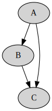

# Design of Optimization on Compiler B

## A. Test cases / Scenarios
> Analyses that extract useful guidance for potential transformations without altering the IR

### 1. Liveness Analysis
**Original**
```python
def f(x: int):
  if True:
    return x + 1
  else:
    x = x * 2
    return x + 1
```
**Tagged**
```python
def f(x: int):
  if True:
    return x + 1
  # Dead
  else:
    x = x * 2
    return x + 1
  # Dead
```

### 2. IR-CFG Visualization
**Pseudo IR-CFG**
```python
while True:
  A() # L-A
  if-goto L-C
  B()
  C() # L-C
```
**Dot-plot**



> Modifications on the ast / IR to improve efficiency 
### 3. Eliminate Unreachable Instructions After Return
**Before Optimization**
```python
def f(i:int):
    return i
    print(i+1)
```
**After Optimization**
```python
def f(i:int):
    return i
```

### 4. Eliminate Dead Branch
**Before Optimization**
```python
def f(i:int):
    if True:
      return i + 1
    else:
      return i * 2
```
**After Optimization**
```python
def f(i:int):
    return i + 1
```

### 5. Eliminate instructions that only affects dead variables

**Before Optimization**
```python
a: int = 1
b: int = 2
a = a + 1
b = b + a
return a
```

**After Optimization**
```python
a: int = 1
b: int = 2
a = a + 1
return a
```

### 6. Constant Propagation

**Before Optimization**
```python
x:int = 100
y:int = 10
y = x + 1
x = x + x
```
**After Optimization**

```python
y:int = 10
y = 100 + 1
x = 100 + 100
```

### 7. Constant Folding For Int

**Before Optimization**
```python
x:int = 5
x = x * 0
```
**After Optimization**
```python
x:int = 5
x = 0
```

### 8. Constant Folding For Bool

**Before Optimization**
```python
x: bool = True
x = False or (False and True)
```
**After Optimization**
```python
x: bool = True
x = False
```

### 9. Combine Redundant Code

**Before Optimization**
```python
x:int = 1
y:int = 2
a:int = 0
a = 2 * (x+y) + 3 * (y + x) + 5 * (x+y)
```

**After Optimization**
```python
x:int = 1
y:int = 2
a:int = 0
e:int = 0
e = x + y
a = 2 * e + 3 * e + 5 * e
```

### 10. Eliminate Redundant Code
**Before Optimization**
```python
x:int = 1
x = x
```

**After Optimization**
```python
x:int = 1
```

### 2. Modification on AST and IR
We aim to leave `ast` and `IR` as intact as possible. We are expecting to compute useful informations out of current framework instead of attaching the information to their implementations.

### 3. New Changes
Two new files `ast-opt` and `ir-opt` may be added to implement optimizations on `ast` and `ir` respectively.
Among these two options, a majority of optimizations will be implemented in the first one since we can take advantage of the existing informations and control-flow awareness. Once we move to the second stage where structured information is obfuscated, we can apply relatively simple and general schemes that optimize the CFG topologically. We may not change the process of *ast -> ir* or *ir -> wasm text* as this may complicate the implementation of optimizations.

### 4. Value Rep and Memory Layout
Dynamic optimizations that happen at runtime or may rely on runtime informations are beyond our scope, so we may not introduce new modifications to the runtime environment. Overall, we aim to optimize the program without imposing restrictions or new assumptions on other groups.